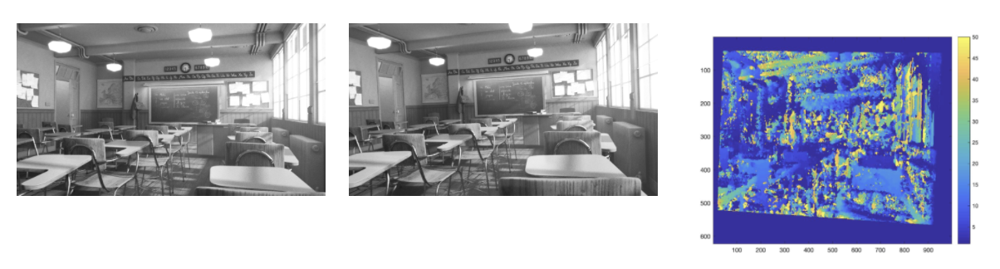
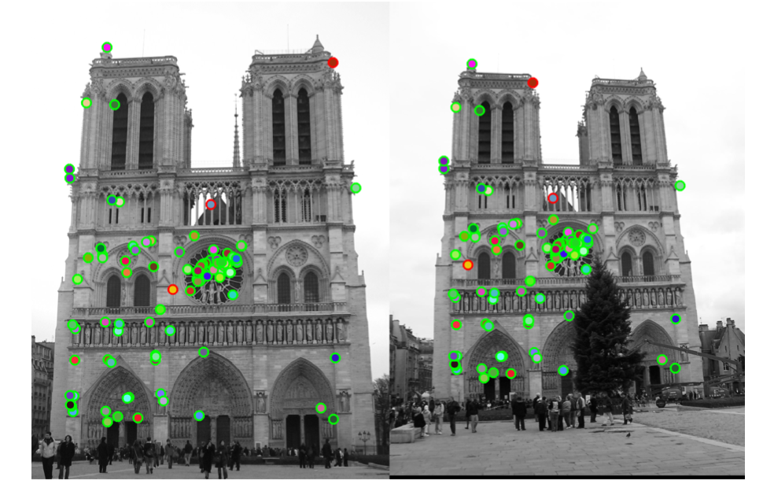

# Introduction to Computer Vision

KAIST 2019 Fall CS484 (Introduction to Computer Vision) Assignments
Assignments for CS484 Introduction to Computer Vision, 2019 Fall, KAIST.
Instructions and skeleton codes are provided from the course, by KAIST [VISUAL COMPUTING Lab](vclab.kaist.ac.kr).

### Requirements
- **Assignment 1 ~ 3**
MATLAB 2017a or above, Image Processing Toolbox, Computer Vision Toolbox, Statistics and Machine Learning Toolbox
- **Assignment 4 ~ 5**
MATLAB 2019b or above, Image Processing Toolbox, Computer Vision Toolbox, Statistics and Machine Learning Toolbox

## Assignments

### 1. Introduction to MATLAB
Toy project to get familiar with MATLAB including vectorization technique.
### 2. Convolution image filter using FFT
Implementation of convolution image filter, using `fft` and `ifft`.
### 3. Image rectification and disparity map calculation

Given two bayer pattern images and feature points, demosaic them, find the fundamental matrix, find homography matrices, rectify them and generate a disparity map.
### 4. Stereo image feature matching
 
Given two stereo images, find interest points, create feature descriptors, and match the features.
### 5. Image classification
Image representation (Tiny images, Bag of words) and classification (Nearest neighbor, Support Vector Machine).

